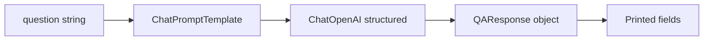
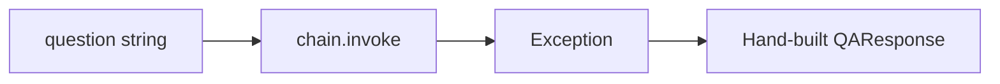

# Learning LangChain: `main.py` Explained From Scratch

This README explains **every line** of [`main.py`](main.py) for a complete beginner.

You do **not** need to know LangChain, OpenAI APIs, or advanced Python yet. We will build up from zero.

---

## Table of contents

1. [What this program does](#1-what-this-program-does)
2. [Prerequisites and how to run it](#2-prerequisites-and-how-to-run-it)
3. [Big-picture mental model](#3-big-picture-mental-model)
4. [End-to-end data flow](#4-end-to-end-data-flow)
5. [Block-by-block walkthrough](#5-block-by-block-walkthrough)
6. [What happens when you run the file](#6-what-happens-when-you-run-the-file)
7. [Important limitations](#7-important-limitations)
8. [Glossary](#8-glossary)
9. [Line-range map](#9-line-range-map)
10. [Safe beginner experiments](#10-safe-beginner-experiments)
11. [Recap](#11-recap)

---

## 1. What this program does

[`main.py`](main.py) builds a tiny **Smart Q&A Bot**.

In plain English:

1. You give it a question (a string of text).
2. It sends that question to an OpenAI chat model (`gpt-4o` by default).
3. It forces the model’s reply into a fixed shape called `QAResponse`.
4. You get back fields like:
   - `answer`
   - `confidence`
   - `reasoning`
   - `follow_up_questions`
   - `sources_needed`

Then three demo functions print examples:

- one question at a time
- several questions in a batch
- a long “edge case” question

---

## 2. Prerequisites and how to run it

### What you need

- Python **3.13+** (see [`pyproject.toml`](pyproject.toml))
- [`uv`](https://github.com/astral-sh/uv) (this project uses `uv.lock`)
- An OpenAI API key
- Optional: a LangSmith API key if you want traces in the LangSmith UI

### Install dependencies

From the project folder:

```bash
uv sync
```

That installs the locked packages, including:

- `langchain` 1.3.13
- `langchain-core` 1.4.9
- `langchain-openai` 1.3.5
- `python-dotenv` 1.2.2
- and transitive deps such as `langsmith` and `pydantic`

### Create a `.env` file

In the project root, create a file named `.env` (it is gitignored — do **not** commit secrets):

```bash
OPENAI_API_KEY=sk-your-real-key-here
```

Optional LangSmith tracing:

```bash
LANGSMITH_TRACING=true
LANGSMITH_API_KEY=your-langsmith-key
LANGSMITH_PROJECT=learning-main-py
```

Without LangSmith env vars, the `@traceable` decorators are mostly harmless — they just won’t send useful traces to the LangSmith website.

### Run the demos

```bash
uv run python main.py
```

### Cost warning

This script makes **real networked API calls** to OpenAI. That can cost money. A full run creates **3 bot instances** and attempts about **7 model requests**:

- 3 sequential questions in `demo_qa_bot`
- 3 batch questions in `demo_batch_processing`
- 1 long question in `demo_error_handling`

---

## 3. Big-picture mental model

Think of the bot as a **form-filling assistant**.

| Piece | Role |
|-------|------|
| `QAResponse` | The blank form the answer must fill |
| `ChatPromptTemplate` | The instructions + question template |
| `ChatOpenAI(...).with_structured_output(...)` | The AI that must fill the form |
| `self.chain = self.prompt \| self.model` | Glue: prompt output becomes model input |
| `ask(...)` | Ask one question, catch errors gracefully |
| `ask_batch(...)` | Ask many questions through `.batch(...)` |
| demo functions | Print results so you can see it work |

Important distinction:

- The program can force a **shape** (fields and types).
- The program cannot force **truth**. The AI can still be wrong, overconfident, or invent reasoning.

---

## 4. End-to-end data flow

Happy path:



Error path inside `ask()` only:



---

## 5. Block-by-block walkthrough

For each block we use the same beginner template:

1. One-liner
2. Inputs → Outputs
3. Data flow
4. Weird syntax only
5. Filled mini-example
6. Not happening yet

---

### Block A — Imports and `load_dotenv()` (lines 1–7)

```python
from dotenv import load_dotenv
from langchain_openai import ChatOpenAI
from typing import List
from pydantic import BaseModel, Field
from langsmith import traceable
from langchain_core.prompts import ChatPromptTemplate
load_dotenv()
```

#### 1. One-liner
Bring in helper libraries, then load secrets from `.env` into environment variables.

#### 2. Inputs → Outputs

| When | In | Out / effect |
|------|----|--------------|
| Import lines | — | Names like `ChatOpenAI`, `BaseModel`, `traceable` become available |
| `load_dotenv()` | `.env` file on disk | Env vars such as `OPENAI_API_KEY` become readable by later code |

#### 3. Data flow

1. Python reads each `from ... import ...` line.
2. Those names become usable in this file.
3. `load_dotenv()` looks for `.env`.
4. If found, values like `OPENAI_API_KEY=...` are loaded into the process environment.
5. Later, `ChatOpenAI(...)` can read that key automatically.

#### 4. Weird syntax only

- **`from X import Y`** — “From package/module `X`, bring name `Y` into this file.”
- **`load_dotenv()`** — reads `.env`; does not print your key; does not call OpenAI.
- **`List`** — typing helper for “a list of …” (used later as `List[str]`).
- **`BaseModel`, `Field`** — Pydantic tools for defining validated data shapes.
- **`traceable`** — LangSmith decorator that can record function runs.
- **`ChatPromptTemplate`** — LangChain prompt builder for chat messages.
- **`ChatOpenAI`** — LangChain wrapper around OpenAI chat models.

#### 5. Filled mini-example

If `.env` contains:

```bash
OPENAI_API_KEY=sk-abc123
```

then after `load_dotenv()`, later code can act as if that key already existed in the environment.

#### 6. Not happening yet
No bot is created. No question is asked. No API call happens.

---

### Block B — `QAResponse` schema (lines 11–22)

```python
class QAResponse(BaseModel):
    answer: str = Field(description="The answer to the user's question.")
    confidence: str = Field(description="Confidence level: high, medium, or low")
    reasoning: str = Field(description="The reasoning behind the answer provided.")
    follow_up_questions: List[str] = Field(
        description="A list of follow-up questions related to the topic.",
        default_factory=list,
    )
    sources_needed: bool = Field(
        description="Indicates whether sources are needed for the answer.",
        default=False,
    )
```

#### 1. One-liner
A Pydantic model that defines the exact fields every answer should have.

#### 2. Inputs → Outputs

| When | In | Out |
|------|----|-----|
| **Defined** | Field names, types, descriptions, defaults | A class/schema named `QAResponse` |
| **Constructed later** | Values for required fields (and optional ones if you want) | A `QAResponse` object with attribute access like `response.answer` |

Required fields (no default):

- `answer: str`
- `confidence: str`
- `reasoning: str`

Optional fields (have defaults):

- `follow_up_questions` defaults to a new empty list
- `sources_needed` defaults to `False`

#### 3. Data flow

1. `class QAResponse(BaseModel)` means “this is a validated data shape.”
2. Each annotated field becomes part of the schema.
3. `Field(description=...)` attaches human-readable guidance.
4. Later, structured-output mode sends that schema to the model.
5. When values come back, Pydantic validates/coerces them into a `QAResponse` instance.

#### 4. Weird syntax only

- **`class QAResponse(BaseModel):`** — create a class that inherits Pydantic’s `BaseModel`.
- **`answer: str`** — type hint: this field should be a string.
- **`List[str]`** — a list whose items are strings.
- **`Field(description=...)`** — metadata for humans/tools; also used as guidance for structured output.
- **`default=False`** — if omitted, use `False`.
- **`default_factory=list`** — if omitted, call `list()` to make a **new** empty list each time.
  - Why not `default=[]`? Shared mutable defaults are a classic Python footgun. `default_factory=list` avoids sharing one list across instances.
- **`bool`** — `True` or `False`.

#### 5. Filled mini-example

```python
response = QAResponse(
    answer="Paris",
    confidence="high",
    reasoning="Paris is widely known as the capital of France.",
    follow_up_questions=["What is the population of Paris?"],
    sources_needed=False,
)

print(response.answer)       # Paris
print(response.confidence)   # high
```

If you omit `follow_up_questions` and `sources_needed`, they become `[]` and `False`.

#### 6. Not happening yet
This only defines the form. It does not ask a question or call a model.

---

### Block C — `SmartQABot.__init__` (lines 27–48)

```python
class SmartQABot:
    def __init__(self, model_name: str = "gpt-4o", temperature: float = 0.3):
        self.model = ChatOpenAI(model=model_name, temperature=temperature).with_structured_output(QAResponse)
        self.prompt = ChatPromptTemplate.from_messages(
            [
                (
                    "system",
                    """You are a knowledgeable Q&A assistant.

Your guidelines:
- Answer questions accurately and concisely
- Be honest about uncertainty - set confidence to 'low' if unsure
- Provide clear reasoning for your answers
- Suggest relevant follow-up questions
- Indicate if external sources would help

Always respond with accurate, helpful information.""",
                ),
                ("human", "{question}"),
            ]
        )
        self.chain = self.prompt | self.model
```

#### 1. One-liner
When you create a bot, wire together: chat model + structured output + prompt + chain.

#### 2. Inputs → Outputs

| When | In | Out |
|------|----|-----|
| **`SmartQABot()` constructed** | optional `model_name`, optional `temperature` | A bot object with `.model`, `.prompt`, `.chain` |
| Defaults | `model_name="gpt-4o"`, `temperature=0.3` | Same, using those defaults |

What each attribute becomes:

| Attribute | Type / meaning |
|-----------|----------------|
| `self.model` | Chat model that returns a `QAResponse` |
| `self.prompt` | Template with a `{question}` blank |
| `self.chain` | Runnable pipeline: prompt then model |

#### 3. Data flow

1. `SmartQABot()` calls `__init__`.
2. `ChatOpenAI(...)` creates an OpenAI chat client wrapper.
3. `.with_structured_output(QAResponse)` says: “return a `QAResponse`, not free-form text.”
4. `ChatPromptTemplate.from_messages([...])` builds a 2-message template:
   - system instructions
   - human message containing `{question}`
5. `self.prompt | self.model` connects them into one chain.

#### 4. Weird syntax only

- **`class SmartQABot:`** — a custom object type for our bot.
- **`def __init__(self, ...):`** — constructor; runs when you write `SmartQABot()`.
- **`self`** — “this instance.” Attributes like `self.model` belong to that specific bot.
- **`model_name: str = "gpt-4o"`** — parameter with a type hint and a default value.
- **`temperature: float = 0.3`** — controls randomness. Lower usually means more focused/deterministic.
- **`.with_structured_output(QAResponse)`** — bind the Pydantic schema so invoke returns a model instance (or fails validation), not a raw chat string.
- **`ChatPromptTemplate.from_messages([...])`** — build a chat prompt from role/text pairs.
- **`("system", "...")`** — tuple = `(role, content)`.
  - `"system"` = instructions to the model
  - `"human"` = user message
- **`"{question}"`** — placeholder. Later invoke must supply `{"question": "..."}`.
- **`self.prompt | self.model`** — LCEL pipe. Left output becomes right input.
- **Triple-quoted string `"""..."""`** — multi-line string for the system prompt.

#### 5. Filled mini-example

```python
bot = SmartQABot()
# same as:
# bot = SmartQABot(model_name="gpt-4o", temperature=0.3)
```

After this line:

- `bot.prompt` knows about `{question}`
- `bot.model` knows to return `QAResponse`
- `bot.chain` can be invoked with `{"question": "What is Python?"}`

#### 6. Not happening yet
Creating the bot does **not** call OpenAI. It only configures objects.

---

### Block D — Prompt messages and `{question}` (inside `__init__`)

#### 1. One-liner
The prompt is a reusable chat script: fixed system rules + one blank for the user’s question.

#### 2. Inputs → Outputs

| When | In | Out |
|------|----|-----|
| Prompt defined | role/text pairs | `ChatPromptTemplate` |
| Prompt invoked (by the chain) | `{"question": "..."}` | Formatted chat messages (system + human) |

#### 3. Data flow

1. System text tells the model how to behave.
2. Human text is literally `{question}` until filled.
3. At invoke time, `"What is the capital of France?"` replaces `{question}`.
4. The model then “sees” two messages: system instructions, then the filled human question.

#### 4. Weird syntax only

- Placeholders use `{curly_braces}`.
- The placeholder name must match the dict key you pass later: `{question}` ↔ `"question"`.

#### 5. Filled mini-example

Input to the prompt/chain:

```python
{"question": "What is the capital of France?"}
```

Model roughly sees:

1. **System:** You are a knowledgeable Q&A assistant. … guidelines …
2. **Human:** What is the capital of France?

#### 6. Not happening yet
Defining the template does not send anything to OpenAI.

---

### Block E — Structured output (inside `__init__`)

#### 1. One-liner
Tell the chat model: “Don’t just chat. Fill the `QAResponse` form.”

#### 2. Inputs → Outputs

| When | In | Out |
|------|----|-----|
| Model invoked via chain | Formatted prompt/messages | A `QAResponse` instance |

#### 3. Data flow

1. Schema fields/descriptions are attached to the model.
2. Model generates values for those fields.
3. Result is parsed/validated into `QAResponse`.
4. Your Python code can use `response.answer`, etc.

#### 4. Weird syntax only

- Without structured output, you’d often get an `AIMessage` with free text.
- With structured output, you get a typed object matching your schema (when parsing succeeds).

#### 5. Filled mini-example

Instead of:

```text
"The capital of France is Paris."
```

you get something like:

```python
QAResponse(
    answer="Paris",
    confidence="high",
    reasoning="...",
    follow_up_questions=["..."],
    sources_needed=False,
)
```

#### 6. Not happening yet
Structured output setup still does not call the API by itself.

---

### Block F — The LCEL chain `prompt | model` (line 48)

#### 1. One-liner
One pipeline object: fill the prompt, then call the structured model.

#### 2. Inputs → Outputs

| When | In | Out |
|------|----|-----|
| `chain.invoke(...)` | `{"question": "..."}` | `QAResponse` |
| `chain.batch([...])` | list of `{"question": "..."}` dicts | list of `QAResponse` |

#### 3. Data flow

```text
{"question": "..."}
        |
        v
 ChatPromptTemplate  -->  formatted messages
        |
        v
 structured ChatOpenAI  -->  QAResponse
```

#### 4. Weird syntax only

- **`|`** here is **not** bitwise OR. In LangChain LCEL it means “compose runnables.”
- Left side’s **output** becomes right side’s **input**.

#### 5. Filled mini-example

```python
result = bot.chain.invoke({"question": "What is Python?"})
# result is a QAResponse
```

#### 6. Not happening yet
Assigning `self.chain = ...` only builds the pipeline. Invoke/batch happen later.

---

### Block G — `ask()` (lines 50–63)

```python
@traceable(name="ask_question", run_type="chain")
def ask(self, question: str) -> QAResponse:
    try:
        response = self.chain.invoke({"question": question})
        return response
    except Exception as e:
        # return a greaceful error response
        return QAResponse(
            answer="I'm sorry, I couldn't process your question at this time.",
            confidence="low",
            reasoning=str(e),
            follow_up_questions=["Could you please try again later?"],
            sources_needed=True,
        )
```

#### 1. One-liner
Ask one question through the chain; if anything fails, return a hand-built polite error `QAResponse`.

#### 2. Inputs → Outputs

| When | In | Out |
|------|----|-----|
| Success | `question: str` | `QAResponse` from the model |
| Failure | same | fallback `QAResponse` built in the `except` block |

Return type annotation `-> QAResponse` means “this function is intended to return a `QAResponse`.”

#### 3. Data flow

1. Decorator may record this call as a LangSmith run named `ask_question`.
2. `try` attempts the happy path.
3. `self.chain.invoke({"question": question})` runs prompt → model.
4. On success, return that `QAResponse`.
5. On any `Exception`, catch it as `e`.
6. Build a fallback `QAResponse` whose `reasoning` is `str(e)` (the error text).

#### 4. Weird syntax only

- **`@traceable(...)`** — decorator. It wraps the function so LangSmith can log inputs/outputs/timing when tracing is enabled.
- **`name="ask_question"`** — label shown in traces.
- **`run_type="chain"`** — tells LangSmith this run is a chain-style step.
- **`try:` / `except Exception as e:`** — “attempt this; if it blows up, handle it.”
- **`str(e)`** — turn the exception into a readable string.
- **Dictionary `{"question": question}`** — maps placeholder name to value.
- Note: the comment says `greaceful` (typo for “graceful”); behavior is still “return a soft error object.”

#### 5. Filled mini-example

Success:

```python
response = bot.ask("What is the capital of France?")
print(response.answer)  # e.g. "Paris"
```

Failure (conceptual):

```python
# if invoke raises, ask() still returns a QAResponse like:
QAResponse(
    answer="I'm sorry, I couldn't process your question at this time.",
    confidence="low",
    reasoning="...error message...",
    follow_up_questions=["Could you please try again later?"],
    sources_needed=True,
)
```

#### 6. Not happening yet
Defining `ask` does not ask anything. It runs only when called.

---

### Block H — `ask_batch()` (lines 65–69)

```python
@traceable(name="ask_batch", run_type="chain")
def ask_batch(self, questions: List[str]) -> List[QAResponse]:
    """Ask multiple questions in parallel."""
    inputs = [{"question": q} for q in questions]
    return self.chain.batch(inputs)
```

#### 1. One-liner
Convert many question strings into many chain inputs, then run them with `.batch(...)`.

#### 2. Inputs → Outputs

| When | In | Out |
|------|----|-----|
| Called | `questions: List[str]` | `List[QAResponse]` |

#### 3. Data flow

1. Start with `["What is Python?", "What is JavaScript?", ...]`.
2. List comprehension builds:
   `[{"question": "What is Python?"}, {"question": "What is JavaScript?"}, ...]`
3. `self.chain.batch(inputs)` runs the chain over that list.
4. Return one `QAResponse` per input (same order).

#### 4. Weird syntax only

- **Docstring** `"""Ask multiple questions in parallel."""` — human description of the function.
- **List comprehension** `[{"question": q} for q in questions]` — build a new list by looping.
- **`.batch(inputs)`** — invoke the runnable on many inputs (LangChain may process them concurrently depending on config/defaults).
- **Critical difference from `ask()`:** there is **no** `try/except` here. A failure can raise instead of returning a soft fallback.

#### 5. Filled mini-example

```python
responses = bot.ask_batch(["What is Python?", "What is Rust?"])
# responses[0] corresponds to "What is Python?"
# responses[1] corresponds to "What is Rust?"
```

#### 6. Not happening yet
Defining the method does not send batch requests. That happens when demos call it.

---

### Block I — `demo_qa_bot()` (lines 73–99)

```python
def demo_qa_bot():
    bot = SmartQABot()

    questions = [
        "What is the capital of France?",
        "Explain the theory of relativity.",
        "How does photosynthesis work?",
    ]

    print("=" * 60)
    print("SMART Q&A BOT DEMO")
    print("=" * 60)

    for question in questions:
        print(f"\n Question: {question}")
        print("-" * 40)

        response = bot.ask(question)

        print(f"Question: {question}")
        print(f"Answer: {response.answer}")
        print(f"Confidence: {response.confidence}")
        print(f"Reasoning: {response.reasoning}")
        print(f"Follow-up Questions: {response.follow_up_questions}")
        print(f"Sources Needed: {response.sources_needed}")
        print("-" * 60)
```

#### 1. One-liner
Create one bot, ask three questions one-by-one, print every `QAResponse` field.

#### 2. Inputs → Outputs

| When | In | Out / effect |
|------|----|--------------|
| Function runs | hard-coded question list | prints to the terminal; performs 3 `ask()` calls |

#### 3. Data flow

1. Make a `SmartQABot`.
2. Define three example questions.
3. Print a header using `"=" * 60` (the `=` character repeated 60 times).
4. Loop each question.
5. Call `bot.ask(question)`.
6. Print answer/confidence/reasoning/follow-ups/sources flag.

#### 4. Weird syntax only

- **`for question in questions:`** — loop through the list.
- **`f"... {variable} ..."`** — f-string; inserts values into text.
- **`"=" * 60`** — string repetition for a visual separator.
- Attribute access: `response.answer`, not `response["answer"]`.

#### 5. Filled mini-example (shape only; real text varies)

```text
============================================================
SMART Q&A BOT DEMO
============================================================

 Question: What is the capital of France?
----------------------------------------
Question: What is the capital of France?
Answer: Paris
Confidence: high
Reasoning: ...
Follow-up Questions: [...]
Sources Needed: False
------------------------------------------------------------
```

#### 6. Not happening yet
Defining the function does nothing until the `if __name__ == "__main__"` block calls it.

---

### Block J — `demo_error_handling()` (lines 102–116)

```python
@traceable(name="error_handling_demo", run_type="chain")
def demo_error_handling():
    """Demonstrate error handling."""

    bot = SmartQABot()

    print("\n" + "=" * 60)
    print("ERROR HANDLING DEMO")
    print("=" * 60)

    # Test with a very long question (edge case)
    long_question = "What is " + "very " * 100 + "important?"

    response = bot.ask(long_question)
    print(f"Handled gracefully: {response.confidence}")
```

#### 1. One-liner
Build a very long question and send it through `ask()`, then print the confidence field.

#### 2. Inputs → Outputs

| When | In | Out / effect |
|------|----|--------------|
| Runs | generated long question string | one `ask()` call; prints confidence |

#### 3. Data flow

1. Create another fresh `SmartQABot`.
2. Build `long_question` by repeating the word `"very "` 100 times.
3. Call `bot.ask(long_question)`.
4. Print whether the response confidence looks like a graceful result.

#### 4. Weird syntax only

- **`"very " * 100`** — repeat that substring 100 times.
- **String concatenation** with `+`.
- This is an **edge-case probe**, not a guaranteed crash.

#### 5. Filled mini-example

`long_question` starts like:

```text
What is very very very very ... important?
```

Possible outcomes:

- Model answers normally → confidence might be `"low"`, `"medium"`, or `"high"`.
- Something fails inside `ask()` → fallback returns `confidence="low"`.

#### 6. Not happening yet
This demo does **not** prove an error occurred. It only exercises a long input path.

---

### Block K — `demo_batch_processing()` (lines 119–140)

```python
@traceable(name="batch_demo", run_type="chain")
def demo_batch_processing():
    """Demonstrate batch processing."""

    bot = SmartQABot()

    questions = [
        "What is Python?",
        "What is JavaScript?",
        "What is Rust?",
    ]

    print("\n" + "=" * 60)
    print("BATCH PROCESSING DEMO")
    print("=" * 60)

    responses = bot.ask_batch(questions)

    for q, r in zip(questions, responses):
        print(f"\n{q}")
        print(f"  -> {r.answer[:100]}...")
        print(f"  Confidence: {r.confidence}")
```

#### 1. One-liner
Ask three questions through `ask_batch`, then print a short preview of each answer.

#### 2. Inputs → Outputs

| When | In | Out / effect |
|------|----|--------------|
| Runs | 3 hard-coded questions | 3 responses; printed previews |

#### 3. Data flow

1. Create another bot.
2. Call `ask_batch(questions)`.
3. `zip(questions, responses)` pairs question #1 with response #1, etc.
4. Print the question, first 100 characters of the answer, and confidence.

#### 4. Weird syntax only

- **`zip(a, b)`** — walk two lists together in lockstep.
- **`r.answer[:100]`** — slicing; first 100 characters of the answer string.
- The trailing `...` in the print is just display text, not Python ellipsis syntax doing truncation logic beyond the slice.

#### 5. Filled mini-example (shape only)

```text
============================================================
BATCH PROCESSING DEMO
============================================================

What is Python?
  -> Python is a high-level programming language...
  Confidence: high
```

#### 6. Not happening yet
No graceful fallback like `ask()` — if batch fails, this demo can crash.

---

### Block L — Entry point (lines 143–150)

```python
if __name__ == "__main__":
    demo_qa_bot()
    demo_batch_processing()
    demo_error_handling()

    print("\n" + "=" * 60)
    print("Section 1 Complete!")
    print("=" * 60)
```

#### 1. One-liner
If you run this file directly, execute the three demos in order.

#### 2. Inputs → Outputs

| When | In | Out / effect |
|------|----|--------------|
| `python main.py` / `uv run python main.py` | — | runs demos top to bottom, then prints completion banner |
| Imported as a module | — | demos do **not** auto-run |

#### 3. Data flow

1. Python sets `__name__` to `"__main__"` when the file is the program entry point.
2. Call `demo_qa_bot()`.
3. Call `demo_batch_processing()`.
4. Call `demo_error_handling()`.
5. Print “Section 1 Complete!”

#### 4. Weird syntax only

- **`if __name__ == "__main__":`** — the standard “only run this when executed directly” guard.
- If another file does `import main`, class/functions become available, but these demo calls stay skipped.

#### 5. Filled mini-example

Command:

```bash
uv run python main.py
```

Order you should expect:

1. SMART Q&A BOT DEMO
2. BATCH PROCESSING DEMO
3. ERROR HANDLING DEMO
4. Section 1 Complete!

#### 6. Not happening yet
Nothing else in the file runs after that banner.

---

## 6. What happens when you run the file

Concrete execution trace:

1. Imports load.
2. `load_dotenv()` runs.
3. Class definitions for `QAResponse` and `SmartQABot` are created in memory.
4. Function definitions for demos are created (not executed yet).
5. Because of the main guard, demos start:
   1. **`demo_qa_bot`**
      - creates bot instance #1
      - 3 sequential `ask()` calls → ~3 model requests
   2. **`demo_batch_processing`**
      - creates bot instance #2
      - 1 `ask_batch()` with 3 questions → ~3 model requests
   3. **`demo_error_handling`**
      - creates bot instance #3
      - 1 `ask()` with a long question → ~1 model request
6. Prints `Section 1 Complete!`

So one full successful run is about **7 model requests** across **3 bot instances**.

### Sample output shape (non-deterministic)

Exact wording changes every run. Expect a shape like:

```text
============================================================
SMART Q&A BOT DEMO
============================================================

 Question: What is the capital of France?
----------------------------------------
Question: What is the capital of France?
Answer: Paris
Confidence: high
Reasoning: ...
Follow-up Questions: ['What is the population of Paris?', ...]
Sources Needed: False
------------------------------------------------------------
...
============================================================
BATCH PROCESSING DEMO
============================================================
...
============================================================
ERROR HANDLING DEMO
============================================================
Handled gracefully: low
...
============================================================
Section 1 Complete!
============================================================
```

---

## 7. Important limitations

Read these carefully so the file doesn’t feel more magical than it is:

1. **Shape ≠ truth.** Structured output enforces fields/types, not factual correctness.
2. **`confidence` is model-generated.** The model chooses `"high"`, `"medium"`, or `"low"` based on instructions — it is not a calibrated probability.
3. **`reasoning` is model-generated.** It can sound convincing even when wrong.
4. **`sources_needed` does not fetch sources.** It is only a boolean flag. No retrieval, no citations, no web search happens in this file.
5. **The long question may not error.** `demo_error_handling` builds an edge-case string; OpenAI might still answer it normally.
6. **`ask_batch` has no graceful fallback.** Only `ask()` catches exceptions and returns a soft `QAResponse`.
7. **Tracing needs LangSmith config.** `@traceable` is present, but useful UI traces need `LANGSMITH_TRACING=true` and a LangSmith API key.
8. **No memory.** Each question is independent. The bot does not remember previous answers.
9. **No retrieval / RAG / tools.** It answers from the model’s own generation, not from your documents.
10. **Three separate bots.** Each demo constructs its own `SmartQABot()`; there is no shared conversation state.

---

## 8. Glossary

| Term | Plain meaning |
|------|----------------|
| API key | Secret password that lets your code call OpenAI/LangSmith |
| `.env` | Local file for secrets/config; loaded by `load_dotenv()` |
| LLM / chat model | The AI text model you send messages to |
| Prompt | Instructions + user text sent to the model |
| System message | Rules/personality instructions |
| Human message | The user’s question/content |
| Placeholder `{question}` | Blank filled at invoke time |
| Pydantic model | Validated Python data shape |
| Structured output | Force model output into that shape |
| LCEL `|` chain | Compose steps so one output feeds the next |
| `invoke` | Run the chain once |
| `batch` | Run the chain on many inputs |
| Decorator `@...` | Wrapper that adds behavior around a function |
| Trace | Recorded run history (inputs, outputs, timing, errors) |
| Temperature | Randomness knob for model outputs |
| Exception | An error that interrupts normal execution |
| Main guard | `if __name__ == "__main__":` entry-point pattern |

---

## 9. Line-range map

| Lines in `main.py` | What it is |
|--------------------|------------|
| 1–7 | Imports + `load_dotenv()` |
| 11–22 | `QAResponse` schema |
| 27–48 | `SmartQABot.__init__` (model, prompt, chain) |
| 50–63 | `ask()` with graceful error fallback |
| 65–69 | `ask_batch()` |
| 73–99 | `demo_qa_bot()` sequential demo |
| 102–116 | `demo_error_handling()` long-question demo |
| 119–140 | `demo_batch_processing()` batch demo |
| 143–150 | Script entry point |

---

## 10. Safe beginner experiments

Try these one at a time:

1. Change one demo question string and re-run.
2. Print only `response.answer` to reduce noise.
3. Change `temperature` to `0.0` and compare variability.
4. Add one more question to the batch list.
5. Temporarily remove your `OPENAI_API_KEY` and observe `ask()`’s fallback path.
6. Enable LangSmith env vars and inspect a trace named `ask_question`.

Avoid committing `.env`. Rotate any key you accidentally share.

---

## 11. Recap

Execution order of a direct run:

1. Load libraries and `.env`
2. Define `QAResponse` (the answer form)
3. Define `SmartQABot` (prompt + structured model + chain)
4. Define helper methods `ask` / `ask_batch`
5. Define demos
6. Under the main guard:
   - ask 3 questions sequentially
   - ask 3 questions in a batch
   - ask 1 long edge-case question
7. Print “Section 1 Complete!”

If you remember only one sentence:

> **`main.py` turns a question string into a validated `QAResponse` object by piping a chat prompt into an OpenAI model with structured output.**
