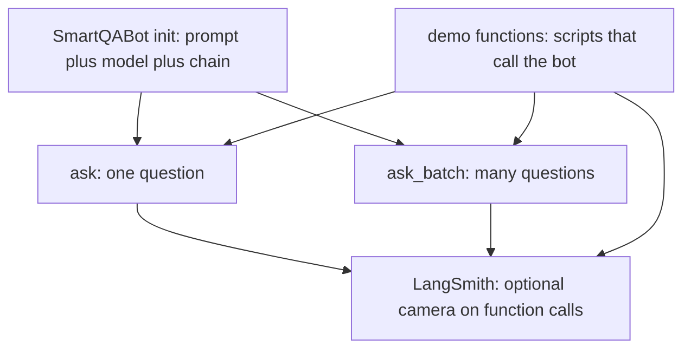
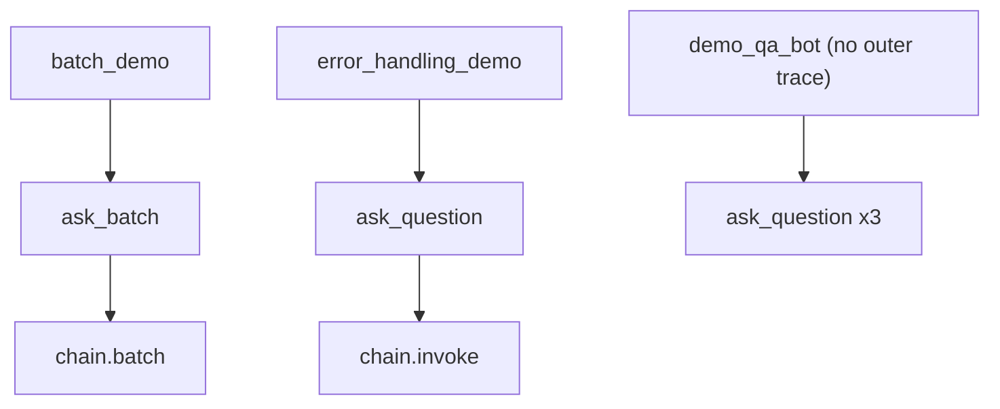

# SmartQABot + LangSmith: Beginner Guide

This README explains the hard middle of [`main.py`](main.py) (lines 27–150): **why `class SmartQABot` exists**, how `ask` / `ask_batch` work, and what **LangSmith `@traceable`** is doing.

It does **not** walk every import line-by-line. If you already get `QAResponse` and the prompt basics, you can jump to [§4](#4-why-class-smartqabot-exists).

---

## Table of contents

1. [What this file teaches](#1-what-this-file-teaches)
2. [Run it](#2-run-it)
3. [30-second mental model](#3-30-second-mental-model)
4. [Why `class SmartQABot` exists](#4-why-class-smartqabot-exists)
5. [LangSmith tracing deep dive](#5-langsmith-tracing-deep-dive)
6. [The three demos as scripts](#6-the-three-demos-as-scripts)
7. [Production takeaways](#7-production-takeaways)
8. [Mini glossary](#8-mini-glossary)

---

## 1. What this file teaches

[`main.py`](main.py) builds a tiny Q&A bot, then runs three demos.

The confusing part for beginners is usually not “call OpenAI.” It is:

- Why wrap everything in a **class**?
- Why decorate some functions with **`@traceable`**?
- Why decorate **demos** too — and why one demo has **no** decorator?

Those are production-style patterns: **encapsulation** (class) and **observability** (tracing). This README focuses there.



---

## 2. Run it

### Install

```bash
uv sync
```

Requires Python **3.13+** (see [`pyproject.toml`](pyproject.toml)).

### `.env`

```bash
OPENAI_API_KEY=sk-your-real-key-here
```

Optional LangSmith (needed to see traces in the UI):

```bash
LANGSMITH_TRACING=true
LANGSMITH_API_KEY=your-langsmith-key
LANGSMITH_PROJECT=learning-main-py
```

Without those LangSmith vars, `@traceable` is mostly harmless — your printed answers still work; you just won’t get useful traces in the LangSmith website.

### Run

```bash
uv run python main.py
```

### Cost warning

This script makes **real** OpenAI API calls. A full run creates **3** `SmartQABot()` instances and about **7** model requests:

- 3 sequential questions in `demo_qa_bot`
- 3 batch questions in `demo_batch_processing`
- 1 long question in `demo_error_handling`

---

## 3. 30-second mental model

| Piece | Role |
|-------|------|
| `QAResponse` | Blank form the answer must fill (`answer`, `confidence`, `reasoning`, `follow_up_questions`, `sources_needed`) |
| `SmartQABot` | Machine that fills the form (prompt + model + chain + methods) |
| Demo functions | Print scripts that create a bot and call it |
| `@traceable` | Optional camera: logs function runs to LangSmith when enabled |

Important distinction:

- The program can force a **shape** (fields and types).
- The program cannot force **truth**. The model can still be wrong.

---

## 4. Why `class SmartQABot` exists

### One-liner

`SmartQABot` is a reusable package: build the LLM plumbing once in `__init__`, then call `ask` / `ask_batch` whenever you need answers.

### Why not skip the class?

Without a class, every demo would rebuild:

- the chat model
- the prompt template
- the `prompt | model` chain

With a class:

```python
bot = SmartQABot()          # build plumbing once
response = bot.ask("...")   # use the public API
```

That is the production habit: **construct a service, then call methods.** The demos are callers, not the AI logic.

### Block: `__init__` (lines 27–48)

```python
class SmartQABot:
    def __init__(self, model_name: str = "gpt-4o", temperature: float = 0.3):
        self.model = ChatOpenAI(model=model_name, temperature=temperature).with_structured_output(QAResponse)
        self.prompt = ChatPromptTemplate.from_messages([...])  # system + human "{question}"
        self.chain = self.prompt | self.model
```

#### 1. One-liner
When you create a bot, wire together: structured chat model + prompt + chain.

#### 2. Inputs → Outputs

| When | In | Out |
|------|----|-----|
| `SmartQABot()` constructed | optional `model_name`, optional `temperature` | A bot object with `.model`, `.prompt`, `.chain` |
| Defaults | `model_name="gpt-4o"`, `temperature=0.3` | Same, using those defaults |

| Attribute | Meaning |
|-----------|---------|
| `self.model` | Chat model forced to return a `QAResponse` |
| `self.prompt` | Template: system instructions + human `{question}` |
| `self.chain` | Pipeline: prompt output feeds the model |

#### 3. Data flow

1. `SmartQABot()` calls `__init__`.
2. `ChatOpenAI(...).with_structured_output(QAResponse)` builds a model that must fill the form.
3. `ChatPromptTemplate.from_messages([...])` stores the system text and a human slot `{question}`.
4. `self.chain = self.prompt | self.model` glues them (LCEL pipe).
5. Nothing calls OpenAI yet — only wiring.

#### 4. Weird syntax only

- **`class SmartQABot:`** — custom object type for our bot.
- **`def __init__(self, ...):`** — constructor; runs when you write `SmartQABot()`.
- **`self.`** — “store this on the bot instance so methods can reuse it.”
- **`.with_structured_output(QAResponse)`** — force replies into the `QAResponse` shape.
- **`("system", "...")` / `("human", "{question}")`** — chat roles + text; `{question}` is a placeholder.
- **`self.prompt \| self.model`** — LCEL: left runnable’s output becomes right runnable’s input.

#### 5. Filled mini-example

```python
bot = SmartQABot()
# bot.model, bot.prompt, bot.chain now exist
# no API call yet
```

#### 6. Not happening yet
`__init__` only builds the pipeline. Invoke/batch happen later in `ask` / `ask_batch`.

---

### Block: `ask` (lines 50–63)

```python
@traceable(name="ask_question", run_type="chain")
def ask(self, question: str) -> QAResponse:
    try:
        response = self.chain.invoke({"question": question})
        return response
    except Exception as e:
        return QAResponse(
            answer="I'm sorry, I couldn't process your question at this time.",
            confidence="low",
            reasoning=str(e),
            follow_up_questions=["Could you please try again later?"],
            sources_needed=True,
        )
```

#### 1. One-liner
Ask one question through the chain; on failure, return a hand-built polite `QAResponse` instead of crashing.

#### 2. Inputs → Outputs

| When | In | Out |
|------|----|-----|
| Success | `question: str` | `QAResponse` from the model |
| Failure | same | fallback `QAResponse` built in `except` |

#### 3. Data flow

1. (Optional) LangSmith may record this call as a run named `ask_question`.
2. `try` attempts the happy path.
3. `self.chain.invoke({"question": question})` fills `{question}`, then calls the model.
4. On success, return that `QAResponse`.
5. On any `Exception`, catch it as `e` and return a soft error object (`reasoning=str(e)`).

#### 4. Weird syntax only

- **`@traceable(...)`** — decorator; see [§5](#5-langsmith-tracing-deep-dive). Does **not** change the answer text.
- **`name="ask_question"`** — label in LangSmith UI (not the Python method name).
- **`run_type="chain"`** — tells LangSmith this span is chain-style.
- **`try` / `except Exception as e`** — attempt; if it blows up, handle it.
- **`{"question": question}`** — maps placeholder name → value.
- Note: the comment says `greaceful` (typo for “graceful”); behavior is still “return a soft error object.”

#### 5. Filled mini-example

```python
response = bot.ask("What is the capital of France?")
print(response.answer)       # e.g. "Paris"
print(response.confidence)   # e.g. "high"
```

#### 6. Not happening yet
Defining `ask` does not ask anything. It runs only when called.

---

### Block: `ask_batch` (lines 65–69)

```python
@traceable(name="ask_batch", run_type="chain")
def ask_batch(self, questions: List[str]) -> List[QAResponse]:
    """Ask multiple questions in parallel."""
    inputs = [{"question": q} for q in questions]
    return self.chain.batch(inputs)
```

#### 1. One-liner
Convert many question strings into many chain inputs, then run them with `.batch(...)`.

#### 2. Inputs → Outputs

| When | In | Out |
|------|----|-----|
| Called | `questions: List[str]` | `List[QAResponse]` (same order) |

#### 3. Data flow

1. Start with `["What is Python?", "What is JavaScript?", ...]`.
2. List comprehension builds `[{"question": "What is Python?"}, ...]`.
3. `self.chain.batch(inputs)` runs the chain over that list.
4. Return one `QAResponse` per input.

#### 4. Weird syntax only

- **`[{"question": q} for q in questions]`** — list comprehension: build a new list by looping.
- **`.batch(inputs)`** — invoke the runnable on many inputs (may run concurrently depending on defaults/config).
- **No `try/except` here** — unlike `ask()`, a failure can raise instead of returning a soft fallback.

#### 5. Filled mini-example

```python
responses = bot.ask_batch(["What is Python?", "What is Rust?"])
print(responses[0].answer)
```

#### 6. Not happening yet
Defining `ask_batch` does not run anything until you call it.

---

## 5. LangSmith tracing deep dive

This is the part that feels mysterious if you’ve never seen decorators or observability tools.

### One-liner

`@traceable` wraps a function so LangSmith can log **inputs, outputs, timing, and nesting** — when tracing is enabled. It does **not** make the model smarter.

### What a decorator is (plain English)

```python
@traceable(name="ask_question", run_type="chain")
def ask(self, question: str) -> QAResponse:
    ...
```

Means roughly:

1. Python defines `ask`.
2. `@traceable(...)` wraps that function in a thin recorder.
3. When you call `bot.ask(...)`, the wrapper runs: start a trace → call real `ask` → finish the trace → return the **same** `QAResponse`.

If you deleted every `@traceable` line, the printed demo answers would still look the same.

### Env gate

Useful UI traces need:

- `LANGSMITH_TRACING=true`
- `LANGSMITH_API_KEY=...`
- optional `LANGSMITH_PROJECT=...`

Without that, the decorator is mostly a no-op for the website.

### What each `@traceable` in this file is for

| Decorated thing | `name=` in UI | Why it exists |
|-----------------|---------------|---------------|
| `SmartQABot.ask` | `ask_question` | Trace the **business API**: one question |
| `SmartQABot.ask_batch` | `ask_batch` | Trace the **business API**: many questions |
| `demo_batch_processing` | `batch_demo` | Trace the **scenario** that calls batch |
| `demo_error_handling` | `error_handling_demo` | Trace the **scenario** that calls ask on a long question |
| `demo_qa_bot` | *(none)* | No outer wrapper — only inner `ask_question` runs appear |

Business methods vs scenario wrappers:

- Trace **methods** → monitor the real API you’ll keep in production.
- Trace **demos** → see whole “scripts” as parent runs in LangSmith (nice for learning; optional in real apps).

### Nested runs (what you should see)

When a traced function calls another traced function, LangSmith nests them (parent → child).



Concrete expectations after `uv run python main.py` with LangSmith enabled:

1. **`demo_qa_bot`** — no outer run named after the demo. You should see about **3** top-level (or separate) runs named `ask_question`.
2. **`demo_batch_processing`** — one parent run `batch_demo` containing child `ask_batch` (and inside that, the chain/batch work).
3. **`demo_error_handling`** — one parent run `error_handling_demo` containing child `ask_question` → `chain.invoke`.

LangChain may also log its own chain/LLM spans under those; the `@traceable` names above are the ones **this file** explicitly labels.

### Inputs → Outputs for tracing itself

| When | In | Out / effect |
|------|----|--------------|
| Decorated function called, tracing **on** | Same args as the function | Same return value **plus** a logged run in LangSmith |
| Decorated function called, tracing **off** | Same args | Same return value; little/no useful UI trace |

### Not happening yet (common misconception)

`@traceable` does **not**:

- change `QAResponse` fields
- retry failed calls
- validate answers
- replace `try/except`

It only observes.

---

## 6. The three demos as scripts

Demos are **not** the bot. They create a bot, call it, and print.

### `demo_qa_bot` (lines 73–99)

- Builds `SmartQABot()`.
- Loops three questions.
- Calls `bot.ask(question)` each time.
- Prints fields from `QAResponse`.
- **No** `@traceable` on this function.

### `demo_batch_processing` (lines 119–140)

- Marked `@traceable(name="batch_demo", ...)`.
- Builds a fresh `SmartQABot()`.
- Calls `bot.ask_batch(questions)`.
- Prints a short preview of each answer.
- In LangSmith: outer `batch_demo` → inner `ask_batch`.

### `demo_error_handling` (lines 102–116)

- Marked `@traceable(name="error_handling_demo", ...)`.
- Builds a fresh `SmartQABot()`.
- Asks a very long question (`"very " * 100`).
- Still goes through `ask()` — which has the soft `except` path **if** something raises.
- A long question does **not** guarantee an exception; the point is “edge case still returns a `QAResponse` shape when `ask` handles errors.”
- In LangSmith: outer `error_handling_demo` → inner `ask_question`.

### `if __name__ == "__main__"` (lines 143–150)

```python
if __name__ == "__main__":
    demo_qa_bot()
    demo_batch_processing()
    demo_error_handling()
```

- Runs the three demos only when you execute `python main.py` directly.
- If another file does `import main`, the class/functions load, but these demo calls stay skipped.

Each demo constructs its **own** `SmartQABot()` — there is no shared conversation memory between demos.

---

## 7. Production takeaways

- **Package LLM plumbing in a class/service** — `__init__` builds; methods are the API.
- **Keep a stable return shape** — `ask` returns `QAResponse` even on errors so callers don’t special-case crashes.
- **Trace the API you care about** — `ask` / `ask_batch` (and optionally the scenarios that call them).
- **Tracing is observability, not intelligence** — remove `@traceable` and answers stay the same; you just lose the camera.

---

## 8. Mini glossary

| Term | Meaning |
|------|---------|
| **class** | Blueprint for an object; here, the bot type |
| **`__init__`** | Constructor; runs on `SmartQABot()` |
| **decorator** (`@...`) | Wrapper around a function that adds behavior (here: logging) |
| **`invoke`** | Run the chain on **one** input dict |
| **`batch`** | Run the chain on **many** input dicts |
| **structured output** | Force the model reply into a schema (`QAResponse`) |
| **trace / nested run** | A recorded function call; nested when a traced function calls another |
| **LCEL `\|`** | Pipe runnables: left output → right input |
